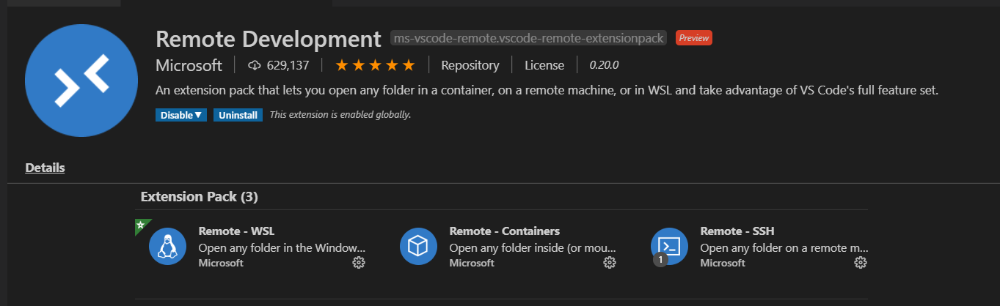

# VS Code Tips
Issei Hiraoka @hoisjp

---
# about me
Issei Hiraoka @hoisjp
coauthor of https://www.amazon.co.jp/dp/4839970920/

プログラマーのためのVisual Studio Codeの教科書
4/30発売!!!!!!!!!!
  
This slides are made by Marp https://github.com/marp-team/marp. Thanks!

---
# Visual Studio Code - Insiders
https://code.visualstudio.com/insiders/
- For early adopters
- Frequent builds
- Side-by-side install

---
# Build-in "Setting Sync" (still only in Insiders)
- Preferences > Turn on
- No Gist!
- Sign in to Micrsoft Account

---
# F1 !!!
- Command Pallete 
  - Win: Shift + Ctrl + p
  - Mac: Shift + Command + p
- Function key? :p

---
# Install WSL 2 and Remote Development
- Microsoft Store
  - Ubuntu 20.04 LTS, NEW!
  - Need WSL 2 kernel update? > https://aka.ms/wsl2kernel
- Extensions: Remote Development

---
# WSL 2 -> Ubuntu 20.04
Switch Distro
  - `wsl --list`
  - `wsl --setdefault Ubuntu-20.04`
  - `wsl --set-version Ubuntu-20.04 2`

---
# Remote WSL
- independent extensions
- `/mnt/c/...` for host machine volume

---
# Firewall? Proxy?
- hostname
https://code.visualstudio.com/docs/setup/network#_common-hostnames

- proxy
https://code.visualstudio.com/docs/setup/network#_proxy-server-support
remember VS Code is Electron = Google Chromium