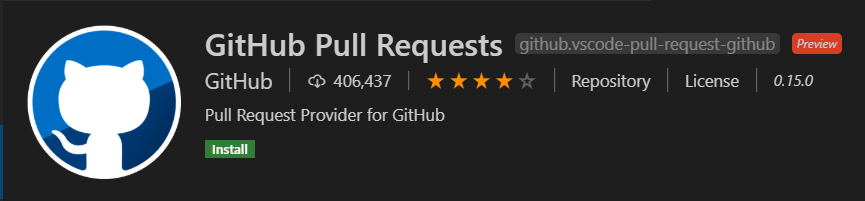

# Git Hub Integration

---
# Extension: GitHub Pull Request
https://marketplace.visualstudio.com/items?itemName=GitHub.vscode-pull-request-github

- Authenticating and connecting
- Listing and browsing
- Reviewing with in-editor commenting
- Validating
- Terminal integration

---
# Extension: Git Lens
https://marketplace.visualstudio.com/items?itemName=eamodio.gitlens

---
# Extension: Git Graph
https://marketplace.visualstudio.com/items?itemName=mhutchie.git-graph

- Tree UI

---
# Extension: Git History

- replaced by Timeline feature?
